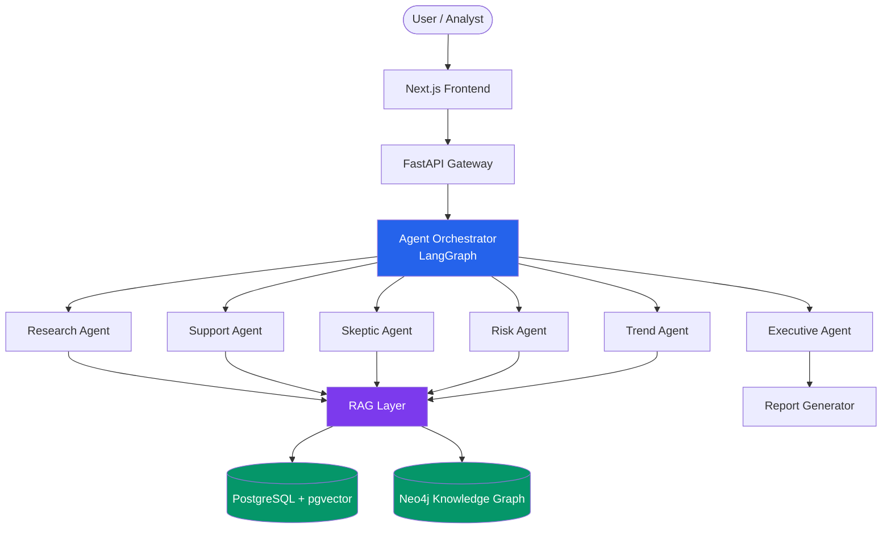

# Innovation Intelligence Copilot

**AI-powered multi-agent platform for enterprise technology advisory and strategic intelligence.**

---

## Why This Exists

Enterprise innovation teams spend thousands of hours manually scanning research papers, patent filings, analyst reports, and market signals to answer questions like *"Should we invest in this technology?"* The answers arrive weeks late, riddled with confirmation bias, and missing the contrarian signals that matter most.

Innovation Intelligence Copilot replaces that workflow with an AI-native platform that ingests diverse data sources, builds a living knowledge graph of technology relationships, and deploys specialized AI agents that collaboratively research, analyze, challenge, and synthesize -- producing executive-ready intelligence in minutes, not months. Every claim is grounded in source documents. Every recommendation comes with a confidence score, risk assessment, and contrarian perspective.

---

## Architecture



---

## Key Features

- **Multi-Agent Analysis** -- Six specialized AI agents (Research, Support, Skeptic, Risk, Trend, Executive) collaborate through a LangGraph workflow to produce balanced, rigorous intelligence
- **RAG with Source Attribution** -- Every generated insight cites its source documents with relevance scores; no ungrounded claims
- **Knowledge Graph** -- Neo4j-powered technology relationship mapping enables adjacency discovery, signal detection, and impact analysis
- **Contrarian Analysis** -- A dedicated Skeptic Agent challenges conclusions, identifies weak assumptions, and surfaces counter-evidence
- **Confidence Scoring** -- Quantified confidence levels on every recommendation with transparent assumption tracking
- **Risk Assessment** -- Structured risk matrices covering strategic, technical, market, and regulatory dimensions
- **Executive Reports** -- Auto-generated, publication-ready strategic intelligence documents
- **Streaming Responses** -- Real-time SSE streaming as agents complete their analysis phases

---

## Example

**Query:**
> "What is the commercial viability of microbial fermentation for producing bio-based adipic acid? Evaluate BASF's position relative to emerging startups."

**Response (summarized):**

| Field | Value |
|-------|-------|
| **Recommendation** | INVEST WITH CAUTION |
| **Confidence** | 72 / 100 |
| **Executive Summary** | Microbial fermentation for bio-based adipic acid shows strong technical promise but faces significant scale-up challenges. BASF holds a competitive advantage through its Genomatica partnership, but three well-funded startups are approaching pilot scale. Break-even requires crude oil above $85/barrel. |

**Supporting Evidence:**
- Genomatica has demonstrated fermentation-derived BDO at pilot scale (Source: *Nature Biotechnology*, relevance: 0.94)
- BASF-Genomatica JV targeting 100 kt/yr capacity by 2026 (Source: *BASF Annual Report 2024*, relevance: 0.91)

**Contrarian Evidence:**
- Petrochemical adipic acid production costs remain 40% lower than bio-based routes at current oil prices (Source: *IHS Markit Chemical Economics Handbook*, relevance: 0.88)

**Key Risks:**
- Feedstock price volatility could erode margin advantage (Market / Medium severity / Likely)
- Regulatory delays for bio-based chemical certifications (Regulatory / Low severity / Possible)

---

## Tech Stack

| Layer | Technology |
|-------|-----------|
| **Backend** | Python 3.12, FastAPI, Pydantic v2 |
| **AI Orchestration** | LangGraph (multi-agent workflows) |
| **LLM Providers** | Anthropic Claude, OpenAI |
| **Vector Store** | PostgreSQL 16 + pgvector |
| **Knowledge Graph** | Neo4j 5 |
| **Cache / Queue** | Redis 7 |
| **Frontend** | Next.js 15, React 19, Tailwind CSS v4 |
| **ORM / Migrations** | SQLAlchemy 2 (async), Alembic |
| **Containerization** | Docker + Docker Compose |

---

## Quick Start

```bash
# Clone the repository
git clone https://github.com/your-org/innovation-intelligence-copilot.git
cd innovation-intelligence-copilot

# Copy environment variables
cp .env.example .env
# Edit .env and add your API keys (ANTHROPIC_API_KEY, OPENAI_API_KEY)

# Start all services
docker compose up -d

# The application will be available at:
#   Frontend:  http://localhost:3000
#   Backend:   http://localhost:8000
#   API docs:  http://localhost:8000/docs
#   Neo4j:     http://localhost:7474
```

---

## Development Setup

### Prerequisites

- Python 3.12+
- Node.js 20+
- Docker and Docker Compose
- [Poetry](https://python-poetry.org/) (Python dependency management)

### Backend

```bash
# Install Python dependencies
poetry install

# Start infrastructure services
docker compose up -d postgres neo4j redis

# Run database migrations
poetry run alembic upgrade head

# Start the development server
poetry run uvicorn backend.app.main:app --reload --port 8000
```

### Frontend

```bash
cd frontend
npm install
npm run dev    # Starts on http://localhost:3000
```

### Running Tests

```bash
# All tests
poetry run pytest

# Unit tests only
poetry run pytest -m unit

# With coverage
poetry run pytest --cov=app --cov-report=html

# Linting and type checking
poetry run ruff check .
poetry run mypy app/
```

---

## API Documentation

Interactive API documentation is available at `/docs` (Swagger UI) and `/redoc` (ReDoc) when the backend is running.

Full API reference: [docs/API.md](docs/API.md) *(coming soon)*

---

## Project Structure

```
innovation-intelligence-copilot/
├── backend/
│   ├── app/
│   │   ├── api/v1/endpoints/   # FastAPI route handlers
│   │   ├── agents/             # LangGraph agent definitions
│   │   ├── rag/                # RAG pipeline (chunker, retriever, reranker)
│   │   ├── graph/              # Neo4j knowledge graph operations
│   │   ├── reports/            # Report generation and rendering
│   │   ├── ingestion/          # Data source connectors and parsers
│   │   ├── models/             # Pydantic models and domain entities
│   │   └── core/               # Config, database, auth, logging
│   └── tests/
│       ├── unit/               # Unit tests
│       └── integration/        # Integration tests
├── frontend/
│   ├── src/
│   │   ├── app/                # Next.js App Router
│   │   ├── components/         # React components
│   │   └── lib/                # Utilities and API client
│   └── public/                 # Static assets
├── docker/
│   ├── backend.Dockerfile      # Python backend image
│   └── frontend.Dockerfile     # Next.js production image
├── docs/
│   ├── CTO_Vision.md           # Strategic design document
│   └── ARCHITECTURE.md         # Technical architecture reference
├── docker-compose.yml          # Full stack orchestration
├── pyproject.toml              # Python project config
├── CONTRIBUTING.md             # Contribution guidelines
└── LICENSE                     # MIT License
```

---

## Roadmap

### Phase 1 -- Analyst Copilot (Current)
- Document ingestion pipeline (PDF, HTML, text)
- RAG-powered Q&A with source citations
- Multi-agent analysis workflow
- Executive report generation
- Interactive dashboard

### Phase 2 -- Technology Intelligence Graph
- Automated knowledge graph construction
- Technology relationship mapping
- Signal strength tracking over time
- Trend monitoring with alerts

### Phase 3 -- Decision Intelligence Engine
- Structured decision frameworks (build/buy/partner)
- Technology readiness assessments
- Competitive landscape analysis
- Portfolio impact modeling

### Phase 4 -- Autonomous Research Agents
- Continuous monitoring of research databases and patent filings
- Proactive alert generation for relevant technology shifts
- Automated weekly/monthly intelligence briefings
- Custom connector marketplace

---

## License

This project is licensed under the MIT License. See [LICENSE](LICENSE) for details.

---

## Contributing

We welcome contributions. Please read [CONTRIBUTING.md](CONTRIBUTING.md) for our development workflow, code standards, and pull request requirements.
