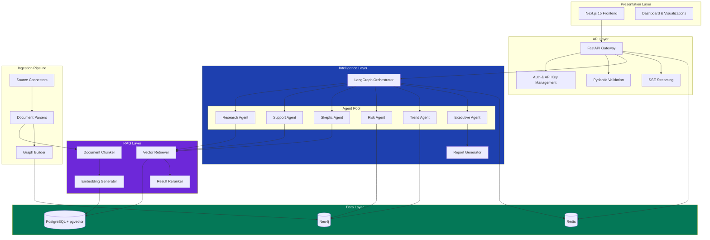
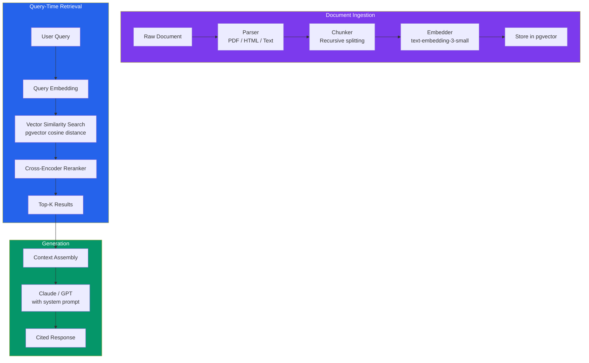

# Technical Architecture

This document provides a detailed technical overview of the Innovation Intelligence Copilot's system architecture, data flows, and component interactions.

---

## System Overview

The platform follows a layered architecture with clear separation between the presentation layer, API gateway, intelligence layer, and data layer.



---

## Component Details

### API Gateway (FastAPI)

The gateway handles all HTTP traffic, authentication, request validation, and response serialization.

| Concern | Implementation |
|---------|---------------|
| Framework | FastAPI with async handlers |
| Validation | Pydantic v2 models on all request/response boundaries |
| Auth | API key + JWT token validation |
| Rate limiting | Redis-backed sliding window |
| Streaming | Server-Sent Events (SSE) for long-running analysis |
| Versioning | URL-based (`/api/v1/`) |
| Health check | `/api/health` endpoint with dependency status |

**Key endpoints:**

```
POST   /api/v1/analysis              Create new analysis request (returns 202 + task_id)
GET    /api/v1/analysis/{id}/status   Poll analysis status
GET    /api/v1/analysis/{id}/result   Retrieve completed analysis
GET    /api/v1/analysis/{id}/stream   SSE stream of agent progress

POST   /api/v1/documents              Ingest a new document
GET    /api/v1/documents/{id}         Retrieve document metadata
POST   /api/v1/documents/search       Semantic search across documents

GET    /api/v1/graph/technologies      List known technologies
GET    /api/v1/graph/relationships     Query technology relationships
GET    /api/v1/graph/signals           Recent technology signals

GET    /api/v1/reports/{id}            Retrieve a generated report
GET    /api/v1/reports/{id}/download   Download as PDF/Markdown
```

---

### Agent Orchestration (LangGraph)

The multi-agent system uses LangGraph to define a directed acyclic graph of agent execution with conditional routing and state management.

```mermaid
graph LR
    Start([Query Received]) --> Router{Query Router}

    Router -->|Full Analysis| Research
    Router -->|Quick Lookup| Research
    Router -->|Trend Check| Trend

    Research[Research Agent<br/>Source Discovery] --> Support[Support Agent<br/>Evidence Building]
    Support --> Skeptic[Skeptic Agent<br/>Contrarian Analysis]
    Skeptic --> Risk[Risk Agent<br/>Risk Assessment]
    Risk --> Trend[Trend Agent<br/>Signal Analysis]
    Trend --> Executive[Executive Agent<br/>Synthesis]

    Executive --> QA{Quality Gate}
    QA -->|Pass| Report[Report Generator]
    QA -->|Fail: Low Confidence| Research

    Report --> Done([Deliver Result])

    style Router fill:#f59e0b,color:#000
    style QA fill:#f59e0b,color:#000
    style Research fill:#3b82f6,color:#fff
    style Support fill:#3b82f6,color:#fff
    style Skeptic fill:#ef4444,color:#fff
    style Risk fill:#ef4444,color:#fff
    style Trend fill:#8b5cf6,color:#fff
    style Executive fill:#059669,color:#fff
```



**Agent specifications:**

| Agent | Role | Inputs | Outputs |
|-------|------|--------|---------|
| **Research** | Source discovery and initial retrieval | Query + context | Relevant document chunks, initial findings |
| **Support** | Evidence building and claim substantiation | Research findings | Structured evidence with citations and confidence scores |
| **Skeptic** | Contrarian analysis and assumption challenging | Support evidence | Counter-evidence, challenged assumptions, bias flags |
| **Risk** | Risk identification and assessment | Combined evidence | Risk matrix (category, severity, likelihood, mitigation) |
| **Trend** | Technology signal detection and trend analysis | Query + graph data | Technology signals, trend directions, maturity assessments |
| **Executive** | Synthesis and recommendation generation | All agent outputs | Executive summary, recommendation, confidence score |

**State management:**

Each analysis run maintains a shared state object that flows through the agent graph:

```python
class AnalysisState(TypedDict):
    query: str
    context: dict[str, object]
    research_findings: list[DocumentChunk]
    supporting_evidence: list[Evidence]
    contrarian_evidence: list[Evidence]
    risks: list[RiskItem]
    technology_signals: list[TechnologySignal]
    key_assumptions: list[str]
    recommendation: str
    confidence_score: int
    executive_summary: str
    agent_traces: list[AgentTrace]
    iteration_count: int
```

---

### RAG Pipeline

The retrieval-augmented generation pipeline ensures all generated content is grounded in source documents.



**Configuration:**

| Parameter | Default | Description |
|-----------|---------|-------------|
| `CHUNK_SIZE` | 1000 | Maximum characters per chunk |
| `CHUNK_OVERLAP` | 200 | Character overlap between consecutive chunks |
| `RETRIEVAL_TOP_K` | 10 | Number of chunks retrieved per query |
| `EMBEDDING_MODEL` | `text-embedding-3-small` | OpenAI embedding model |
| `EMBEDDING_DIMENSIONS` | 1536 | Embedding vector dimensionality |

---

### Knowledge Graph (Neo4j)

The knowledge graph captures relationships between technologies, companies, research groups, and market signals that cannot be effectively represented in a relational or vector store.

**Node types:**

| Label | Description | Key Properties |
|-------|-------------|---------------|
| `Technology` | A specific technology or technique | name, maturity_stage, domain |
| `Company` | Organization involved in the technology | name, type, market_cap |
| `Paper` | Research publication | title, doi, published_date |
| `Patent` | Patent filing | patent_number, filing_date, jurisdiction |
| `Signal` | A detected technology signal | type, strength, detected_date |
| `Trend` | An aggregated trend over time | direction, velocity, time_range |

**Relationship types:**

| Relationship | From | To | Properties |
|-------------|------|-----|-----------|
| `DEVELOPS` | Company | Technology | investment_level, start_year |
| `COMPETES_WITH` | Technology | Technology | dimension |
| `ENABLES` | Technology | Technology | dependency_strength |
| `PUBLISHES` | Company | Paper | role |
| `CITES` | Paper | Paper | citation_context |
| `FILES` | Company | Patent | jurisdiction |
| `INDICATES` | Signal | Technology | confidence |
| `PART_OF` | Signal | Trend | weight |

---

### Data Persistence

| Store | Purpose | Access Pattern |
|-------|---------|---------------|
| **PostgreSQL + pgvector** | Document metadata, chunk storage, vector embeddings, user data, analysis results | Async via SQLAlchemy 2 + asyncpg |
| **Neo4j** | Technology relationship graph, signal detection, trend tracking | Async via neo4j Python driver |
| **Redis** | Response caching, rate limiting, task queue, session store | Async via redis-py with hiredis |

---

### Caching Strategy

```
Request → Redis cache check (TTL: 1hr for queries, 24hr for embeddings)
  ├── Cache HIT  → Return cached result
  └── Cache MISS → Execute pipeline → Store in cache → Return result
```

Cache invalidation triggers:
- New document ingestion (invalidates affected query caches)
- Knowledge graph update (invalidates graph-dependent caches)
- Manual purge via admin API

---

### Error Handling

The system uses a hierarchical exception model:

```
AppException (base)
├── ValidationError          → 422
├── AuthenticationError      → 401
├── AuthorizationError       → 403
├── NotFoundError            → 404
├── ConflictError            → 409
├── RateLimitError           → 429
├── ExternalServiceError     → 502
│   ├── LLMProviderError
│   ├── EmbeddingError
│   └── GraphDatabaseError
└── InternalError            → 500
```

All agents implement retry logic with exponential backoff (via `tenacity`) for transient failures.

---

### Observability

| Concern | Tool |
|---------|------|
| Structured logging | `structlog` with JSON output |
| Request tracing | Correlation IDs on all requests |
| Agent tracing | Duration, token usage, error tracking per agent per run |
| Health checks | `/api/health` with dependency status (Postgres, Neo4j, Redis) |
| Metrics | Agent execution times, cache hit rates, embedding costs |
