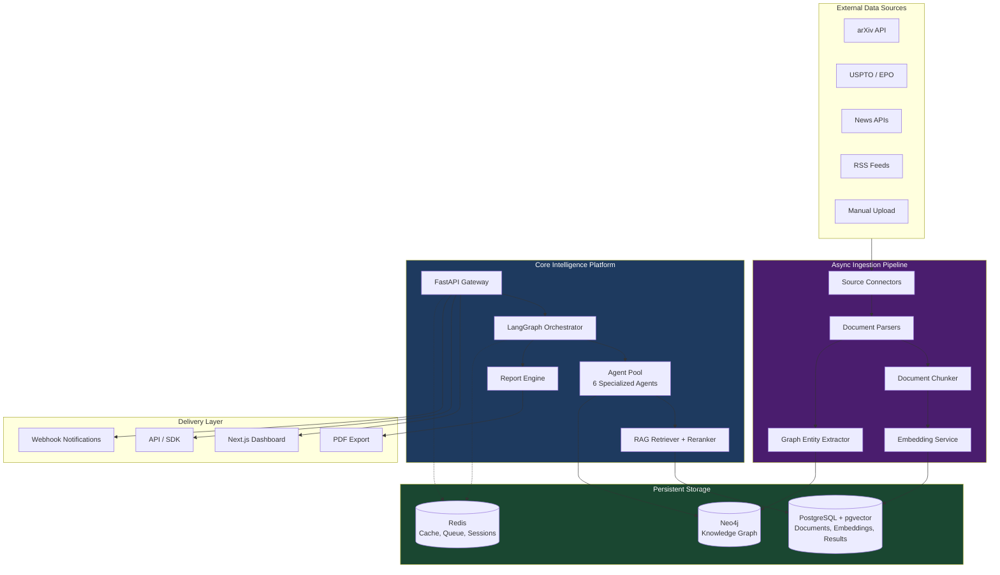
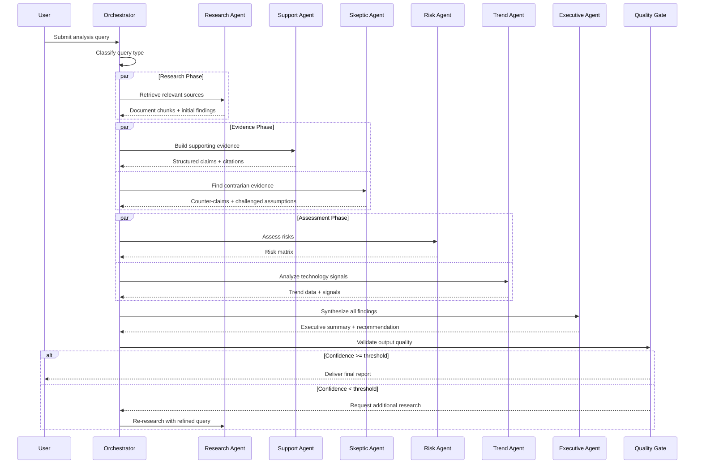
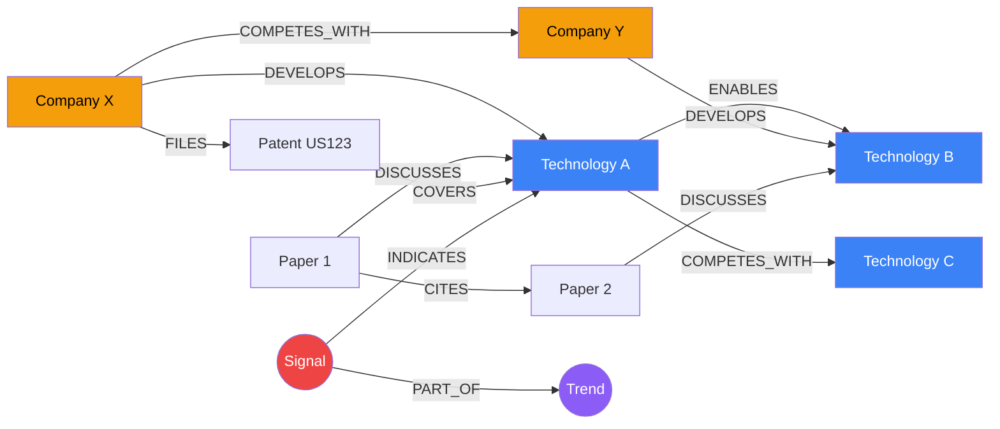

# CTO Vision: Innovation Intelligence Platform

**Strategic Design Document**
**Version 1.0 | 2024**

---

## Table of Contents

1. [Strategic Vision](#strategic-vision)
2. [Technical Architecture](#technical-architecture)
3. [Multi-Agent System Design](#multi-agent-system-design)
4. [RAG Architecture](#rag-architecture)
5. [Knowledge Graph Strategy](#knowledge-graph-strategy)
6. [Decision Intelligence Framework](#decision-intelligence-framework)
7. [Scalability](#scalability)
8. [AI Governance](#ai-governance)
9. [Security Model](#security-model)
10. [Enterprise Architecture](#enterprise-architecture)
11. [Implementation Roadmap](#implementation-roadmap)

---

## Strategic Vision

### What We Are Building

Innovation Intelligence Copilot is not a chatbot. It is a **decision intelligence platform** that transforms how enterprises evaluate, adopt, and act on emerging technologies.

The core insight: technology adoption decisions are the highest-leverage, highest-risk choices an enterprise makes, yet they are still driven by ad hoc analyst workflows, vendor pitches, and conference hallway conversations. The structured intelligence infrastructure that exists for financial markets (Bloomberg terminals, quantitative models, systematic risk assessment) does not exist for technology strategy.

We are building that infrastructure.

### The Problem

Enterprise technology leaders face a compounding information challenge:

1. **Volume** -- Thousands of research papers, patents, market reports, and news articles published daily across hundreds of technology domains.
2. **Bias** -- Vendor-funded research, hype cycles, and confirmation bias systematically distort technology assessments.
3. **Fragmentation** -- Relevant signals are scattered across disconnected databases, formats, and time horizons.
4. **Speed** -- By the time a traditional analyst report is completed (weeks to months), the technology landscape has shifted.
5. **Accountability** -- Recommendations lack structured assumption tracking, confidence scoring, and contrarian analysis.

### Our Position

We occupy a unique position in the market by combining three capabilities that do not exist together in any current product:

| Capability | Existing Tools | Our Approach |
|-----------|---------------|-------------|
| **Multi-source ingestion** | Manual curation, RSS feeds | Automated connectors with structured parsing |
| **Technology relationship mapping** | Static taxonomy databases | Living knowledge graph with temporal signal tracking |
| **Adversarial analysis** | Single-perspective reports | Multi-agent system with dedicated contrarian agents |
| **Decision frameworks** | Spreadsheet models | AI-generated structured frameworks with source grounding |

### Defensibility

Our moat builds across three dimensions:

1. **Knowledge graph density** -- Every document ingested enriches the graph. Relationship density compounds over time, making the platform more valuable with use.
2. **Agent specialization** -- Fine-tuned agent prompts, calibrated confidence scoring, and domain-specific retrieval strategies improve through feedback loops.
3. **Institutional memory** -- Historical analyses, assumption tracking, and decision outcomes create an organizational learning system that no competitor can replicate from outside.

---

## Technical Architecture

### System Topology



### Design Principles

1. **Async-first ingestion, sync-first queries** -- Document processing runs asynchronously through task queues. User-facing queries are synchronous with SSE streaming for progress updates.

2. **Source grounding as a hard constraint** -- The system architecturally prevents ungrounded claims. Every generated statement must trace to a retrieved document chunk. The LLM is constrained by its context window, not by training data recall.

3. **Adversarial by design** -- The agent graph is structured so that supporting evidence and contrarian evidence are generated by different agents with different system prompts. This is not a feature -- it is the architecture.

4. **Composable retrieval** -- Vector search, graph traversal, and keyword search are composable retrieval strategies that can be combined per-query based on the nature of the question.

5. **Observable AI** -- Every agent execution produces a trace record (duration, token usage, errors, intermediate outputs) that enables debugging, cost tracking, and performance optimization.

---

## Multi-Agent System Design

### Why Multi-Agent Over Monolithic

A single-prompt approach to technology analysis fails for three fundamental reasons:

1. **Role contamination** -- When a single LLM call is asked to both advocate for and against a position, it consistently underweights contrarian evidence. Separate agents with dedicated system prompts produce genuinely independent analyses.

2. **Retrieval specialization** -- Different analytical tasks require different retrieval strategies. A research agent needs broad semantic search. A risk agent needs targeted graph queries for regulatory relationships. A trend agent needs temporal queries across signal data. Monolithic retrieval cannot serve all of these optimally.

3. **Composability** -- Not every query needs every agent. A quick factual lookup skips the risk and trend agents. A full strategic assessment uses all six. The agent graph supports conditional routing based on query classification.

### Agent Specialization Rationale

| Agent | Why It Exists Separately |
|-------|-------------------------|
| **Research** | Needs broad retrieval with high recall. Optimized for source discovery, not analysis. Its quality metric is coverage, not precision. |
| **Support** | Builds structured evidence claims from raw research findings. Responsible for citation quality and confidence calibration. |
| **Skeptic** | Must operate independently from the Support agent to avoid confirmation bias. Uses a contrarian system prompt that actively seeks disconfirming evidence. |
| **Risk** | Requires access to the knowledge graph for regulatory relationships, competitive dynamics, and historical failure patterns that are not in the vector store. |
| **Trend** | Operates on temporal signal data (technology maturity curves, adoption rates, patent filing velocity). Different data model than document chunks. |
| **Executive** | Synthesizes all agent outputs into a coherent narrative. Must balance competing evidence without injecting its own analysis. Its role is editorial, not analytical. |

### Agent Orchestration Flow



---

## RAG Architecture

### Hybrid Retrieval Strategy

Simple vector similarity search is insufficient for enterprise technology analysis. We implement a hybrid retrieval approach:

1. **Dense retrieval (pgvector)** -- Semantic similarity search using cosine distance on document chunk embeddings. High recall for conceptually related content.

2. **Sparse retrieval (BM25)** -- Keyword-based retrieval for precise technical terms, company names, and patent numbers that embedding models may not distinguish.

3. **Graph-augmented retrieval** -- Neo4j queries that retrieve documents related to specific technologies, companies, or relationships identified in the knowledge graph.

4. **Temporal retrieval** -- Filtered queries that prioritize recent sources for trend analysis or historical sources for longitudinal studies.

The retrieval strategy is selected by the Orchestrator based on query classification:

| Query Type | Primary Retrieval | Secondary Retrieval |
|-----------|------------------|-------------------|
| Factual lookup | Dense + Sparse | -- |
| Technology assessment | Dense | Graph-augmented |
| Trend analysis | Temporal | Graph-augmented |
| Competitive analysis | Graph-augmented | Dense |
| Risk assessment | Graph-augmented | Dense + Temporal |

### Citation Tracking

Every chunk returned by the retriever carries a citation payload:

```python
@dataclass
class SourceCitation:
    document_id: str          # Unique document identifier
    title: str                # Document title
    chunk_text: str           # The exact text retrieved
    relevance_score: float    # Cosine similarity or reranker score
    page: int | None          # Page number if available
```

Agents are instructed to reference citations by document ID. The report renderer maps IDs to full bibliographic references. **Any generated claim without a citation is flagged by the quality gate.**

### Source Attribution Architecture

The system enforces source attribution at three levels:

1. **Retrieval level** -- Every chunk includes its source document metadata.
2. **Agent level** -- Agent system prompts require explicit citation of chunk IDs in every factual claim.
3. **Quality gate level** -- The output validator cross-references claims against retrieved chunks and flags ungrounded statements.

---

## Knowledge Graph Strategy

### Why a Graph Database

Relational databases excel at structured queries over tabular data. Vector databases excel at semantic similarity. Neither captures the **relationship structure** that is fundamental to technology strategy:

- *"Which companies are developing alternatives to Technology X?"*
- *"What technologies does Company Y depend on that are controlled by a single supplier?"*
- *"What research groups are publishing at the intersection of Technology A and Technology B?"*

These are graph traversal problems. Representing them in SQL requires expensive multi-way joins that do not scale. Representing them as embeddings loses the explicit structural relationships.

### Entity Relationships



### Technology Signal Detection

The graph enables signal detection patterns that are impossible with flat data:

1. **Convergence signals** -- When multiple unrelated companies begin publishing or patenting in the same technology area within a short time window.
2. **Dependency risk signals** -- When a critical technology in a supply chain is controlled by a shrinking number of entities.
3. **Maturity signals** -- When patent filing velocity decelerates while deployment-focused publications increase.
4. **Disruption signals** -- When a new technology node rapidly accumulates `ENABLES` edges to technologies currently served by an incumbent.

---

## Decision Intelligence Framework

### Confidence Scoring

Every analysis output includes a confidence score (0-100) that is computed, not estimated. The score is a weighted combination of:

| Factor | Weight | Measurement |
|--------|--------|-------------|
| Source coverage | 30% | Ratio of retrieved chunks to expected coverage for the topic |
| Source recency | 15% | Weighted average age of cited sources |
| Evidence agreement | 25% | Ratio of supporting to total evidence across agents |
| Agent consensus | 15% | Agreement level between Support and Skeptic assessments |
| Graph density | 15% | Number of graph relationships available for the queried entities |

Scores below 50 trigger a second research iteration with refined queries.

### Assumption Tracking

Every recommendation is paired with its key assumptions, each of which is:

1. **Explicitly stated** -- No hidden premises.
2. **Testable** -- Each assumption can be validated or invalidated by future data.
3. **Attributed** -- The agent that introduced the assumption is recorded.

This creates an institutional record of *why* a recommendation was made, enabling future retrospective analysis when assumptions prove wrong.

### Contrarian Analysis

The Skeptic Agent is not a token dissenter. It is architecturally required to:

1. Identify the strongest supporting evidence and attempt to find contradicting sources.
2. Surface assumptions that the Support Agent treated as given.
3. Identify historical analogies where similar technology optimism was misplaced.
4. Quantify the *cost of being wrong* for each key claim.

This is not adversarial for its own sake -- it is the minimum analytical standard for decisions with significant capital allocation consequences.

---

## Scalability

### Horizontal Scaling Strategy

```
                    Load Balancer
                    ┌─────────────┐
                    │   Nginx     │
                    └──────┬──────┘
                           │
              ┌────────────┼────────────┐
              │            │            │
         ┌────┴────┐  ┌────┴────┐  ┌────┴────┐
         │ API  #1 │  │ API  #2 │  │ API  #3 │
         └────┬────┘  └────┬────┘  └────┬────┘
              │            │            │
              └────────────┼────────────┘
                           │
                    ┌──────┴──────┐
                    │   Redis     │
                    │ (Sessions + │
                    │   Queue)    │
                    └──────┬──────┘
                           │
              ┌────────────┼────────────┐
              │            │            │
         ┌────┴────┐  ┌────┴────┐  ┌────┴────┐
         │Worker #1│  │Worker #2│  │Worker #3│
         │(Agents) │  │(Agents) │  │(Agents) │
         └─────────┘  └─────────┘  └─────────┘
```

**Scaling dimensions:**

| Component | Scaling Strategy | Bottleneck |
|-----------|-----------------|-----------|
| API servers | Horizontal (stateless) | CPU |
| Agent workers | Horizontal (queue-based) | LLM API rate limits |
| PostgreSQL | Vertical + read replicas | Storage I/O |
| pgvector | HNSW index partitioning | Memory |
| Neo4j | Causal cluster (read replicas) | Graph traversal depth |
| Redis | Sentinel / Cluster | Memory |

### Async Processing Model

Long-running analysis requests follow a deferred execution pattern:

1. API receives request, validates, creates task record, returns `202 Accepted` with `task_id`.
2. Task is enqueued to Redis.
3. Worker picks up task, executes agent graph, streams progress updates via SSE.
4. On completion, result is persisted to PostgreSQL and cached in Redis.
5. Client polls `/status` or subscribes to SSE stream.

### Caching Layers

| Layer | TTL | Invalidation |
|-------|-----|-------------|
| Query result cache | 1 hour | New document ingestion, manual purge |
| Embedding cache | 24 hours | Document re-indexing |
| Graph query cache | 30 minutes | Graph mutation events |
| LLM response cache | 1 hour | None (content-addressed by prompt hash) |

---

## AI Governance

### Prompt Safety

All agent system prompts include explicit guardrails:

1. **No fabrication** -- Agents must only make claims grounded in retrieved source material.
2. **Uncertainty disclosure** -- When evidence is insufficient, agents must state uncertainty explicitly rather than speculating.
3. **Scope boundaries** -- Agents refuse to provide advice on topics outside their defined domain (legal advice, medical advice, financial trading recommendations).
4. **PII handling** -- Agents never include raw personal information in outputs; names and emails are referenced by role/entity.

### Hallucination Mitigation

The architecture mitigates hallucination through structural constraints, not just prompt engineering:

1. **Retrieval grounding** -- Agents only see retrieved chunks in their context window, not their training data.
2. **Citation enforcement** -- Every factual claim must reference a specific document chunk ID.
3. **Cross-agent validation** -- The Skeptic Agent independently verifies claims made by the Support Agent.
4. **Quality gate** -- Automated validator cross-references output claims against source chunks before delivery.
5. **Confidence thresholds** -- Low-confidence results trigger re-research rather than delivery.

### Human-in-the-Loop

The platform supports three levels of human oversight:

| Level | Description | When Used |
|-------|-------------|-----------|
| **Full auto** | Results delivered directly | Routine lookups, monitoring alerts |
| **Review gate** | Results queued for human review before delivery | Strategic recommendations, high-stakes decisions |
| **Collaborative** | Human analyst works alongside agents, approving/rejecting intermediate steps | Novel domains, first-time analyses |

---

## Security Model

### API Authentication

| Method | Use Case |
|--------|---------|
| API key (header) | Programmatic access, integrations |
| JWT bearer token | Frontend session authentication |
| Service-to-service tokens | Internal microservice communication |

### Data Isolation

- All user data is scoped by `workspace_id` at the query level.
- Database queries include workspace filters as a mandatory parameter.
- Redis cache keys are namespaced by workspace.
- Neo4j queries are filtered by workspace-scoped labels.

### PII Handling

- No raw PII (emails, names) in log output -- hash or redact.
- Document ingestion strips author contact information before indexing.
- Analysis results reference entities by role, not personal identity.

### Secrets Management

- All secrets loaded via environment variables (Pydantic `BaseSettings`).
- No secrets in code, config files, or version control.
- Production secrets managed via cloud provider secret stores (AWS Secrets Manager, GCP Secret Manager, or equivalent).
- API keys are hashed (bcrypt) at rest in the database; only the prefix is stored for identification.

---

## Enterprise Architecture

### Multi-Tenancy Path

Phase 1 (current): Single-tenant deployment with workspace-level isolation.

Phase 2 (target): Multi-tenant SaaS with:
- Workspace-level data isolation (shared infrastructure, logical separation)
- Per-workspace LLM API key configuration (BYOK)
- Usage metering and billing per workspace
- Workspace-level admin roles and permissions

Phase 3 (enterprise): Dedicated tenant deployments with:
- Customer-managed encryption keys
- VPC peering for on-premises data sources
- Custom data retention policies
- Dedicated compute resources

### SSO / SAML

Enterprise authentication planned for Phase 2:
- SAML 2.0 integration for enterprise IdPs (Okta, Azure AD, OneLogin)
- SCIM provisioning for automated user lifecycle management
- Role mapping from IdP groups to platform roles

### Audit Logging

Every significant action produces an audit log entry:

```python
@dataclass
class AuditEntry:
    timestamp: str
    workspace_id: str
    user_id: str
    action: str           # e.g., "analysis.create", "document.ingest"
    resource_type: str
    resource_id: str
    ip_address: str       # Hashed
    user_agent: str
    metadata: dict        # Action-specific context
```

Audit logs are append-only, retained for a configurable period (default: 2 years), and exportable for compliance reporting.

---

## Implementation Roadmap

### Phase 1: Analyst Copilot (Months 1-3)

**Goal:** Deliver a working multi-agent research platform that produces cited analysis reports.

| Milestone | Deliverable |
|-----------|-------------|
| M1.1 | Document ingestion pipeline (PDF, HTML, text) |
| M1.2 | pgvector RAG pipeline with source citations |
| M1.3 | Multi-agent workflow (Research, Support, Skeptic, Executive) |
| M1.4 | Report generation (Markdown, JSON API) |
| M1.5 | Next.js dashboard with query interface and report viewer |
| M1.6 | Docker Compose deployment |

**Success metric:** End-to-end analysis query returns a cited report in under 60 seconds.

### Phase 2: Technology Intelligence Graph (Months 4-6)

**Goal:** Build a living knowledge graph that enables relationship-driven analysis.

| Milestone | Deliverable |
|-----------|-------------|
| M2.1 | Automated entity extraction from ingested documents |
| M2.2 | Neo4j graph construction and relationship mapping |
| M2.3 | Risk Agent and Trend Agent (graph-augmented) |
| M2.4 | Technology signal detection and alerting |
| M2.5 | Interactive technology radar visualization |
| M2.6 | Automated source connectors (arXiv, news APIs) |

**Success metric:** Graph contains 10,000+ entities with automated relationship extraction accuracy above 85%.

### Phase 3: Decision Intelligence Engine (Months 7-10)

**Goal:** Graduate from research tool to decision support platform.

| Milestone | Deliverable |
|-----------|-------------|
| M3.1 | Structured decision frameworks (build/buy/partner) |
| M3.2 | Technology readiness assessments with scoring |
| M3.3 | Competitive landscape analysis |
| M3.4 | Portfolio impact modeling |
| M3.5 | Historical decision tracking and retrospective analysis |
| M3.6 | Multi-tenant workspace isolation |

**Success metric:** Decision frameworks reduce technology evaluation cycles from weeks to hours for pilot customers.

### Phase 4: Autonomous Research Agents (Months 11-15)

**Goal:** Transition from on-demand queries to continuous intelligence.

| Milestone | Deliverable |
|-----------|-------------|
| M4.1 | Continuous monitoring of configurable technology domains |
| M4.2 | Proactive alert generation for significant signals |
| M4.3 | Automated weekly/monthly intelligence briefings |
| M4.4 | Patent analysis pipeline |
| M4.5 | Custom connector marketplace |
| M4.6 | SSO/SAML enterprise authentication |

**Success metric:** Platform generates actionable intelligence alerts before customers identify the signals through manual monitoring.

---

*This document is a living artifact. It will be updated as architectural decisions are made and validated through implementation.*
